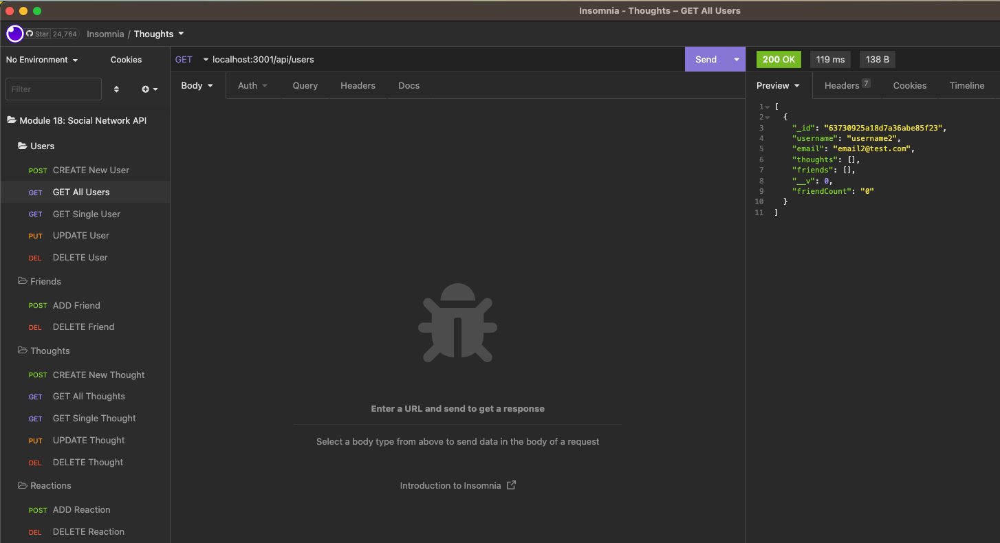

# Social Network API

## Table of Contents
* [Description](#description)
* [Installation instructions](#installation-instructions)
* [Usage Information](#usage-information)
* [License](#license)
* [Contribution Guidelines](#contribution-guidelines)
* [Test Instructions](#test-instructions)
* [Questions](#questions)

## Description
I built an API for a social network web application where users can share their thoughts, react to friends’ thoughts, and create a friend list. I used Express.js for routing, a MongoDB database, and the Mongoose ODM.

## Installation Instructions
Install Node.js before using this application.

## Usage Information
[Click here for a demo video.](https://drive.google.com/file/d/1iwFZPFSx0fTk0q1f78BIOgyH5Dr8CdVr/view)

## License
[MIT](https://opensource.org/licenses/MIT)

## Contribution Guidelines
N/A

## Test Instructions
N/A

## Questions
Have any addition questions? Contact me!
&nbsp;  
GitHub: [sprantis](https://github.com/sprantis)
&nbsp;
Email: sprantis@gmail.com